### Projeto Neex 🔨

Projeto desenvolvido com a finalidade de criar uma API REST de um ecommerce no qual se cria funcionalidades para clientes, produtos e compras.

### Diagrama de Classes

  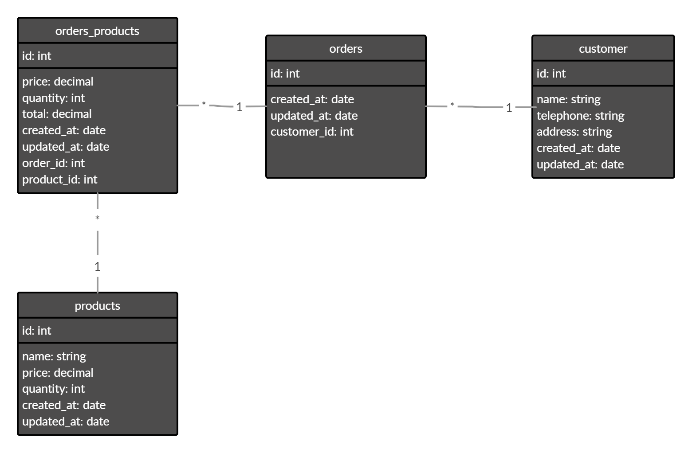

### Tecnologias utilizadas
  - Typescript
  - NodeJS
  - PostgreSQL
  - TypeORM
  - Tsyringe
  - Express
  - Cors

### Clientes

  - Listagem de clientes
  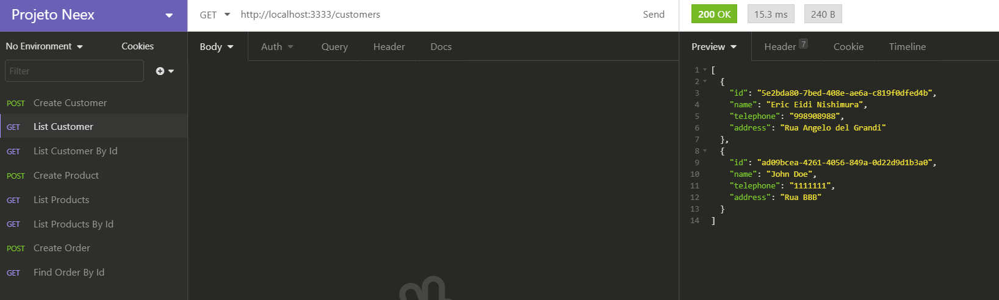
  - Listagem de clientes por Id
  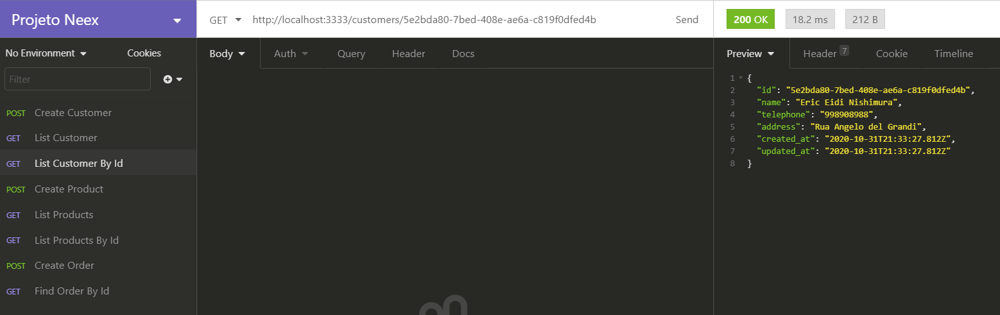
  - Cadastro de clientes
  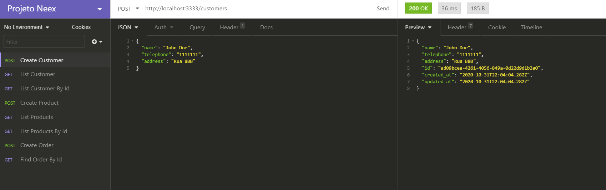

   

  

### Produtos
  - Cadastro de produtos
  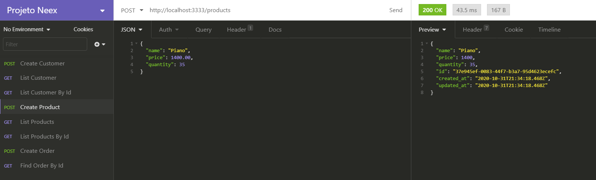
  - Listagem de produtos
  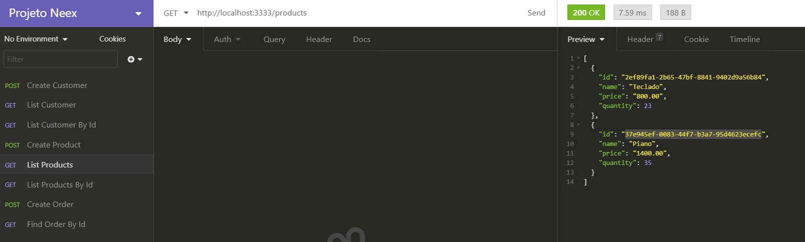
  - Listagem de produtos por Id
  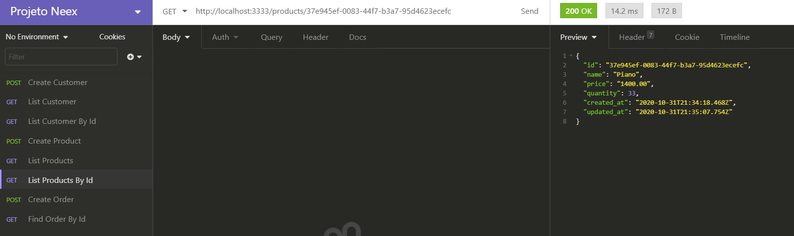

   
   

### Compras
  - Cadastro de compras
  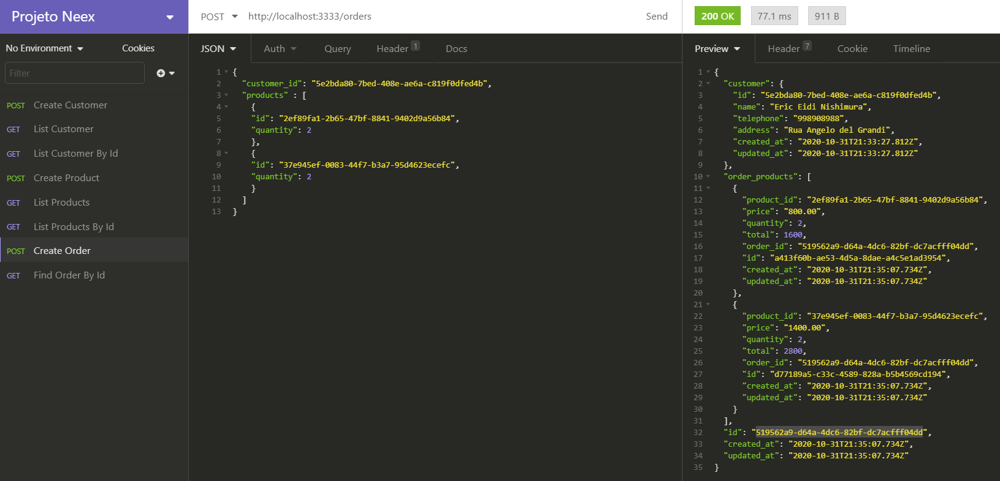
  - Listagem de clientes por Id
  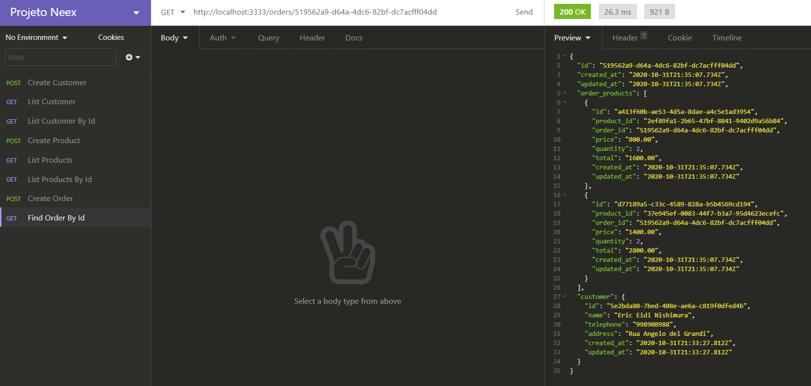
  - Subtração da quantidade de produto ao realizar uma compra
  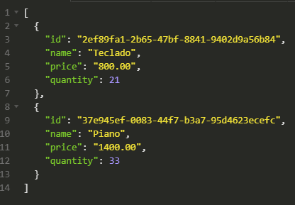
  - Validação de erro ao não encontrar Id do cliente
  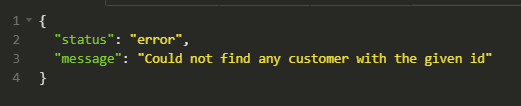
  - Validação de erro ao não encontrar Id do produto
  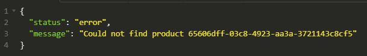
  - Validação de erro ao não possuir quantidade de produto
  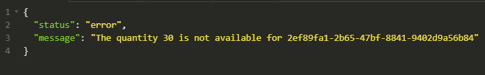

   

